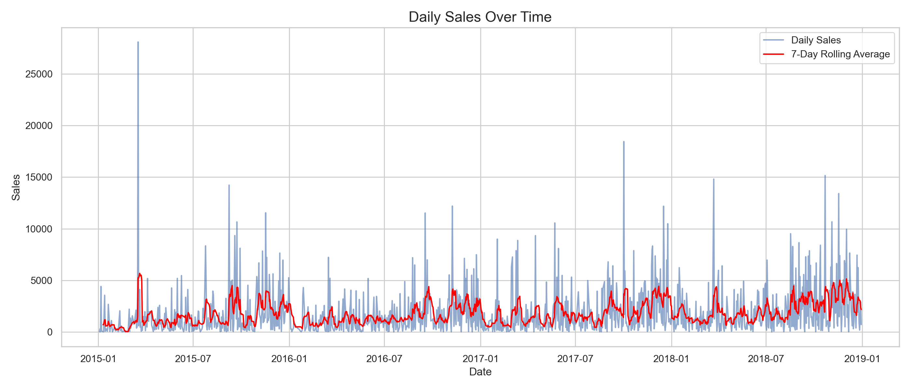
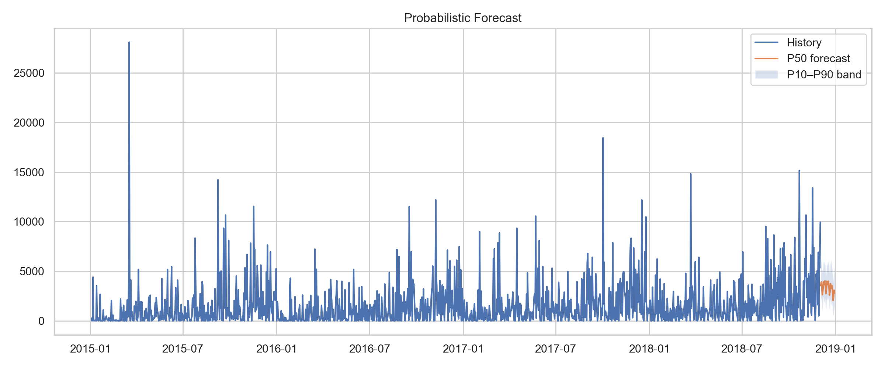

# 📈 Retail Sales Forecasting with Prophet & SARIMA

This project demonstrates **time series forecasting** on retail sales data using  
**Facebook Prophet** and **SARIMA (Seasonal ARIMA)**.  

We built an **end-to-end workflow** covering:
- Exploratory analysis of transactional data
- Aggregation into daily sales
- Model comparison (Prophet vs SARIMA)
- Rolling-origin backtesting (MAE, RMSE, sMAPE)
- Probabilistic forecasting with confidence bands (P10, P50, P90)
- Pinball loss evaluation
- An interactive **Streamlit dashboard** for easy exploration and visualization

---

## ✨ Why Forecast Retail Sales?

Retail businesses need to anticipate:
- **Demand fluctuations** (weekends, holidays, promotions, seasonal cycles)
- **Inventory planning** (avoiding stockouts/overstock)
- **Revenue forecasting** for budgeting

Accurate forecasts drive better **supply chain management** and **strategic decisions**.

---

## 🔮 Why Facebook Prophet?

[Facebook Prophet](https://facebook.github.io/prophet/) is designed for **business time series** with:
- **Strong seasonality** (weekly, yearly patterns)
- **Holidays / special events** (easy to add regressors)
- **Missing values & outliers** robustness
- Fast training, interpretable parameters

Prophet shines in cases like **retail**, where sales show repeating seasonal patterns and trend shifts.

---

## 🛠 Tech Stack

- **Models**: Prophet, SARIMA (via statsmodels)  
- **Python Libraries**: pandas, numpy, scikit-learn, matplotlib, altair  
- **Dashboard**: Streamlit + Altair  
- **Evaluation**: Rolling backtests, Pinball loss, sMAPE  

---

## 📂 Project Structure

```
FB-Prophet-Forecasting/
├─ data/
│  └─ train.csv            # Raw dataset (ignored in .gitignore, add your own)
├─ notebooks/
│  └─ sales-forecasting-with-sarima-prophet.ipynb
├─ src_utils.py            # Core functions (prep, backtest, forecast)
├─ streamlit_app.py        # Interactive dashboard
├─ requirements.txt        # Python dependencies
└─ README.md
```

---

## 🚀 How to Run

### 1. Clone the repo
```bash
git clone https://github.com/yourusername/retail-sales-forecasting.git
cd retail-sales-forecasting
```

### 2. Install dependencies
```bash
pip install -r requirements.txt
```

### 3. Explore notebook
Run the Jupyter notebook for step-by-step analysis:
```bash
jupyter notebook notebooks/sales-forecasting-with-sarima-prophet.ipynb
```

### 4. Launch dashboard
```bash
streamlit run streamlit_app.py
```

Then open the local URL provided by Streamlit.

---

## 📊 Dashboard & Forecast Examples

### Daily Aggregated Sales


### Probabilistic Forecast


---

## 🔍 Key Insights

- Prophet automatically captures **weekly & yearly seasonality** → very useful in retail.  
- SARIMA provides strong baselines for stationary series but needs manual parameter tuning.  
- Rolling backtests show where each model excels.  
- Probabilistic bands (P10/P90) help in **inventory risk management** (how much stock to hold with 90% confidence).  

---

## 🤝 Contributing

Feel free to fork this repo, open issues, and suggest improvements (extra regressors, hyperparameter tuning, MLflow logging, etc.).

---

## 📜 License

This project is released under the MIT License.
